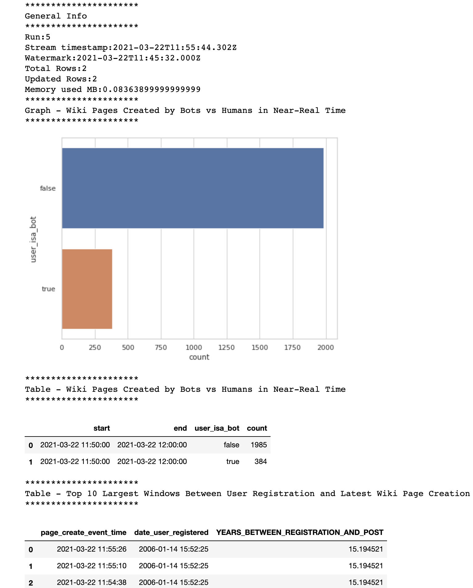

## Wikimedia New Page Creations
### Using Kafka, Parquet Files, and Spark with Wikimedia Streaming API
- Investigate how many pages are recently created by bots vs humans
- Show the time difference between a user (bot or human) registration and its latest create-page event. Many 15+ year old accounts still posting.

## Instructions
1. Start docker containers with compose to start zookeeper, kafka, spark
```
docker-compose up -d
```

2. Get notebook url
```
$ docker exec -it <container_name_prefix>_spark_1 bash
$ jupyter notebook list
```

3. Check out Kafka events
```
$ docker exec -it <container_name_prefix>_kafka_1 bash
$ kafka-console-consumer.sh --bootstrap-server localhost:9092 --topic wiki-changes
```

4. Running Notebooks
- Run full producer code and allow to run "*" 
- Rule consumer code up to while loop and allow to run "*" 
- Runt data viz notebook up to while loop and allow to run "*"



--- 

### Inspired by T. Cordon's repo